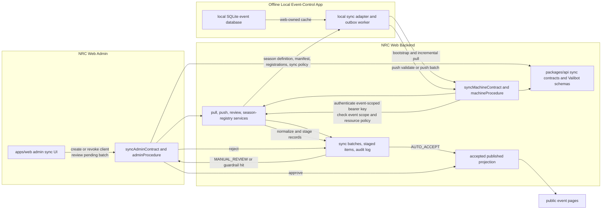

# NRC Web Data Sync Technical Design

## Related Docs

- Implementation-facing API spec for local apps and admin tooling: `docs/nrc_sync_api_spec.md`

## 1. Purpose

This document defines the technical design for data synchronization between `NRC Web` and the offline local event-control application.

It replaces the earlier repo-agnostic draft with a design that matches the current monorepo architecture:

- `packages/api` owns oRPC contracts, Valibot schemas, and shared API types
- `packages/api-service` owns procedure middleware, routers, and application services
- `apps/server` exposes the shared app router through `/rpc`, `/api`, and `/openapi.json`
- `apps/web` consumes the backend through the shared oRPC client and will later host admin sync tooling in `features/admin/sync`
- `packages/db` currently contains auth-related schema only, so sync persistence is a new domain

This document focuses on:

- source-of-truth boundaries
- contract-first API design with oRPC
- Valibot schema design for stable and season-specific sync payloads
- pull and push workflows
- admin review and publish workflow
- mapping the current local SQLite schema to normalized sync resources
- implementation boundaries that fit the current repo layout

This document does not define the final PostgreSQL DDL in full detail. It is the technical input for later database schema work in `packages/db`.

## 2. Current Repo Baseline

### 2.1. Runtime Architecture

Current backend runtime:

- HTTP server: `Hono`
- RPC and OpenAPI generation: `oRPC`
- shared validation library: `Valibot`
- database access: `Drizzle` on PostgreSQL
- human-user auth: `Better Auth`

Current server exposure in `apps/server`:

- `GET` and `POST` `/rpc/*` for oRPC procedures
- `/api` and `/api/*` for generated OpenAPI reference
- `GET /openapi.json` for the generated OpenAPI document

This matters for sync because the sync domain should be defined once in `packages/api` and then automatically appear in both the RPC and OpenAPI surfaces through the existing server handlers.

### 2.2. Current Code Ownership Pattern

The existing repo already follows one clear API ownership model:

| Package                | Responsibility                                                          |
| ---------------------- | ----------------------------------------------------------------------- |
| `packages/api`         | contract definitions, route metadata, Valibot schemas, shared API types |
| `packages/api-service` | router implementations, procedure middleware, domain services           |
| `apps/server`          | Hono transport layer for RPC and OpenAPI                                |
| `apps/web`             | frontend consumption through oRPC client and TanStack Query             |
| `packages/db`          | database schema and Drizzle access                                      |

The sync feature must follow that same pattern. It should not introduce a separate ad hoc API layer or frontend-owned sync types.

### 2.3. Current Gap

At the time of writing:

- there is no sync contract in `packages/api`
- there is no sync router in `packages/api-service`
- there is no machine-auth procedure middleware
- there is no sync persistence schema in `packages/db`
- `apps/web/src/features/admin/sync` exists only as a placeholder

This means sync is a new domain and should be introduced cleanly rather than layered into the current event CRUD placeholders.

## 3. Locked Design Decisions

The following decisions are fixed for this design and should not remain open questions in later implementation work.

### 3.1. Contract Style

- The sync API is contract-first.
- `packages/api` is the source of truth for every sync request and response shape.
- Validation is implemented with Valibot schemas, not loose TypeScript interfaces or untyped JSON blobs.
- The server and OpenAPI docs are generated from the same contract surface.

### 3.2. External Identity

- External event identity is `season + eventCode`.
- `eventKey` is the canonical machine identity in the format `season/eventCode`.
- The canonical public event route is `/:season/:eventCode`.
- Internal database IDs may exist later, but they are not part of the sync contract.

### 3.3. Versioning

- The API surface uses one stable namespace: `/sync/v1`.
- Season-specific behavior does not create new endpoints.
- Season-specific behavior is handled by a season definition registry and season-specific Valibot schemas.

### 3.4. Ownership

- The web system remains authoritative for users, teams, event setup, registrations, sync settings, and public publishing state.
- The local event-control application becomes authoritative for operational event data after sync is enabled.
- In v1, the local application owns:
  - practice schedule and results
  - inspection schedule
  - inspection results
  - match schedule
  - match results
  - rankings
  - awards

### 3.5. Practice Visibility

- Practice data is public in v1.
- Practice is represented by the same normalized match resources used for qualifications and playoffs.
- The public route shape remains season-first, for example `/:season/:eventCode/practice`.

### 3.6. Correction Policy

- Admins may review, accept, or reject local-owned pushes.
- Admins do not directly edit accepted local-owned records in NRC Web.
- Corrections to local-owned data are published by a new push batch from the local system so the audit trail stays coherent.

### 3.7. Machine Authentication

- v1 machine auth uses an event-scoped bearer API key in the `Authorization` header.
- The secret is shown once, hashed at rest, and tied to exactly one event scope.
- TLS is mandatory.
- Replay safety in v1 relies on `batchId` idempotency, request logging, and event-scoped keys.
- Header signing and nonce-based replay protection are deferred hardening work, not part of the v1 contract.

### 3.8. Sync Mode Rules

- `upsert` is used for records that arrive incrementally, especially `inspection_results` and `match_results`
- `replace_snapshot` is used for resources where removals are meaningful, especially `inspection_schedule`, `match_schedule`, `team_rankings`, and `team_awards`
- Every push is staged before it becomes public
- Public pages read only accepted and published data

## 4. Source-of-Truth Boundaries

| Resource                         | Owner     | Notes                                                    |
| -------------------------------- | --------- | -------------------------------------------------------- |
| users                            | web       | managed through Better Auth                              |
| teams and memberships            | web       | team identity should not be created from local push data |
| event metadata                   | web       | created and maintained by admins                         |
| registration settings            | web       | part of event setup                                      |
| approved registrations           | web       | pulled by the local app                                  |
| team operational profiles        | web       | pulled by the local app                                  |
| sync policy and client lifecycle | web       | admin-controlled                                         |
| practice schedule                | local app | public after acceptance                                  |
| practice results                 | local app | public after acceptance                                  |
| inspection schedule              | local app | authoritative after sync is enabled                      |
| inspection results               | local app | authoritative after sync is enabled                      |
| match schedule                   | local app | authoritative after sync is enabled                      |
| match results                    | local app | authoritative after sync is enabled                      |
| rankings                         | local app | authoritative after sync is enabled                      |
| awards                           | local app | authoritative after sync is enabled                      |
| published event pages            | web       | render accepted projections only                         |
| audit logs and review state      | web       | append-only historical record                            |

Operational rule:

- Once sync is enabled for an event, local-owned fields should be read-only in web admin editing flows.
- If a record has been published from local data, the next official correction is another reviewed push, not a direct admin patch.

## 5. Contract-First Architecture

### 5.1. Recommended Repo Structure

The sync domain should follow the current repo layout.

```text
packages/api/src/
├── contracts/
│   ├── sync-machine.contract.ts
│   ├── sync-admin.contract.ts
│   └── sync.contract.ts
└── schemas/
    └── sync/
        ├── common.schema.ts
        ├── pull.schema.ts
        ├── push.schema.ts
        ├── admin.schema.ts
        ├── season-definition.schema.ts
        └── seasons/
            ├── 2025.schema.ts
            └── ...

packages/api-service/src/
├── procedures.ts
├── routers/
│   ├── sync-machine.router.ts
│   ├── sync-admin.router.ts
│   └── sync.router.ts
└── services/
    └── sync/
        ├── application/
        ├── domain/
        ├── infrastructure/
        ├── auth.service.ts
        ├── change-diff.service.ts
        ├── publish.service.ts
        └── season-registry.service.ts
```

Legacy mixed service shells such as `pull.service.ts`, `push.service.ts`, `review.service.ts`, `admin.service.ts`, and their helpers have been retired in the refactor.

`packages/api/src/contracts/app.contract.ts` should spread the sync contract just like the existing event, team, registration, and notification contracts.

`packages/api-service/src/routers/app.router.ts` should compose the sync router the same way it currently composes the other feature routers.

### 5.2. Contract Composition

The sync domain should be split into two contract surfaces:

1. `syncMachineContract`
2. `syncAdminContract`

Then expose them together as one `syncContract` and include that in the app contract.

Reasoning:

- machine procedures use API-key auth and event-scoped permissions
- admin procedures use Better Auth session auth and `ADMIN` role enforcement
- both surfaces still belong to one domain and one generated OpenAPI document

### 5.3. Procedure Layers

`packages/api-service/src/procedures.ts` currently provides:

- `publicProcedure`
- `protectedProcedure`

The sync domain should add:

- `machineProcedure`
- `adminProcedure`

Recommended behavior:

#### `machineProcedure`

- reads `Authorization: Bearer <secret>`
- resolves the active sync client and bound event scope
- injects machine context such as:
  - `syncClientId`
  - `syncEventKey`
  - allowed directions
  - allowed resource types
- rejects missing, revoked, expired, or wrong-scope credentials

#### `adminProcedure`

- starts from authenticated session context
- checks `session.user.userRole === "ADMIN"`
- is used for sync client management, log inspection, and batch review

This separation is necessary because the current repo only supports human session auth, while sync requires non-session machine authentication.

### 5.4. Mermaid Overview

The following Mermaid v11 flowchart summarizes the intended sync architecture and lifecycle.



### 5.5. Canonical Procedures

Recommended machine procedures:

| Procedure             | Method | Path                                                       | Auth    | Purpose                                                    |
| --------------------- | ------ | ---------------------------------------------------------- | ------- | ---------------------------------------------------------- |
| `getSeasonDefinition` | `GET`  | `/sync/v1/seasons/:season/definition`                      | machine | fetch the active season definition and validation metadata |
| `getEventBootstrap`   | `GET`  | `/sync/v1/seasons/:season/events/:eventCode/bootstrap`     | machine | fetch the full initial web-owned snapshot for one event    |
| `getEventChanges`     | `GET`  | `/sync/v1/seasons/:season/events/:eventCode/changes`       | machine | fetch incremental web-owned changes after a cursor         |
| `validateSyncBatch`   | `POST` | `/sync/v1/seasons/:season/events/:eventCode/push/validate` | machine | validate a batch without publishing it                     |
| `pushSyncBatch`       | `POST` | `/sync/v1/seasons/:season/events/:eventCode/push`          | machine | validate, stage, and either publish or queue a batch       |

Recommended admin procedures:

| Procedure          | Method | Path                                                       | Auth  | Purpose                                                               |
| ------------------ | ------ | ---------------------------------------------------------- | ----- | --------------------------------------------------------------------- |
| `listSyncClients`  | `GET`  | `/sync/v1/admin/seasons/:season/events/:eventCode/clients` | admin | list active and revoked sync clients for one event                    |
| `createSyncClient` | `POST` | `/sync/v1/admin/seasons/:season/events/:eventCode/clients` | admin | create a new sync client and return the one-time secret               |
| `revokeSyncClient` | `POST` | `/sync/v1/admin/clients/:clientId/revoke`                  | admin | revoke a sync client without deleting its history                     |
| `listSyncBatches`  | `GET`  | `/sync/v1/admin/seasons/:season/events/:eventCode/batches` | admin | list recent applied, pending, duplicate, rejected, and failed batches |
| `getSyncBatch`     | `GET`  | `/sync/v1/admin/batches/:changeSetId`                      | admin | inspect one batch, its diff, warnings, and raw metadata               |
| `reviewSyncBatch`  | `POST` | `/sync/v1/admin/batches/:changeSetId/review`               | admin | approve or reject a pending batch                                     |

These admin procedures are the future backend for `apps/web/src/features/admin/sync`.

## 6. Schema Design

### 6.1. Schema Conventions

To match the current repo style:

- path params are strings in Valibot input schemas
- IDs and opaque cursors are strings
- timestamps are ISO 8601 UTC strings
- enums are shared from schema modules, not duplicated in frontend code
- request and response types are derived from Valibot schemas in `packages/api`

Important contract choice:

- represent `season` as a four-digit string, for example `"2025"`

Reasoning:

- it is used in URL params
- it is part of `eventKey`
- it is identifier-like, not arithmetic data
- it avoids a contract split where path params are strings but bodies use numbers

### 6.2. Common Primitives

The sync schema layer should define shared primitives first.

Recommended primitives:

- `seasonSchema`: four-digit string
- `eventCodeSchema`: uppercase event code string
- `eventKeySchema`: derived or validated `season/eventCode`
- `definitionVersionSchema`: string such as `2025.1`
- `schemaVersionSchema`: string such as `2026-03-08`
- `syncClientIdSchema`
- `batchIdSchema`
- `cursorSchema`
- `resourceTypeSchema`
- `syncModeSchema`
- `syncBatchStatusSchema`
- `syncReviewModeSchema`
- `scheduleOwnerSchema`

Recommended resource types:

- `season_definition`
- `event_manifest`
- `approved_registrations`
- `team_operational_profiles`
- `sync_policy`
- `inspection_schedule`
- `inspection_results`
- `match_schedule`
- `match_results`
- `team_rankings`
- `team_awards`

### 6.3. Stable Pull Models

Pull should use a fixed resource object because the web-owned resources are known and small in number.

Recommended stable pull models:

#### `season_definition`

- `season`
- `definitionVersion`
- `gameCode`
- `gameName`
- `matchResultDetailsVersion`
- `rankingDetailsVersion`
- `publicViews`
- `diffLabels`

#### `event_manifest`

- `season`
- `eventCode`
- `eventKey`
- `canonicalPath`
- `name`
- `venue`
- `timezone`
- `startsAt`
- `endsAt`
- `definitionVersion`
- `scheduleOwner`
- `syncReviewMode`
- `isSyncEnabled`

#### `approved_registrations`

- `registrationId`
- `teamId`
- `teamNumber`
- `teamName`
- `organizationName`
- `status`
- `mentorContacts`
- `operationalNotes`

#### `team_operational_profiles`

- `teamId`
- `teamNumber`
- `teamName`
- `pitLabel`
- `contactSummary`
- `specialRequirements`

#### `sync_policy`

- `eventKey`
- `reviewMode`
- `scheduleOwner`
- `allowedPushResources`
- `allowedPullResources`
- `updatedAt`

### 6.4. Stable Push Models

Push uses a generic batch envelope with resource-specific record arrays.

Recommended stable push record models:

#### `inspection_schedule`

- `externalInspectionItemId`
- `teamNumber`
- `stationNumber`
- `stage`
- `startsAt`
- `durationMinutes`
- `status`

#### `inspection_results`

- `teamNumber`
- `stage`
- `status`
- `recordedAt`
- `comment`

#### `match_schedule`

- `matchKey`
- `phase`
- `matchNumber`
- `playNumber`
- `description`
- `scheduledAt`
- `status`
- `alliances`
- `externalScheduleDetailId`

#### `match_results`

- `matchKey`
- `phase`
- `status`
- `playedAt`
- `redScore`
- `blueScore`
- `redPenalty`
- `bluePenalty`
- `winnerAlliance`
- `alliances`
- `cards`
- `disqualifications`
- `noShows`
- `details`
- `externalMatchId`

#### `team_rankings`

- `teamNumber`
- `rank`
- `rankChange`
- `wins`
- `losses`
- `ties`
- `matchesPlayed`
- `qualifyingScore`
- `pointsScoredTotal`
- `pointsScoredAverage`
- `sortOrders`
- `details`
- `modifiedAt`

#### `team_awards`

- `awardCode`
- `awardName`
- `displayOrder`
- `teamNumber`
- `recipient`
- `isPublic`
- `comment`
- `assignedAt`

### 6.5. Shared Match Shape

Practice, qualification, and playoff records should use one normalized match shape.

Recommended match phase enum:

- `PRACTICE`
- `QUALIFICATION`
- `PLAYOFF`

This keeps the contract stable and avoids separate payload formats for practice, quals, and elims.

### 6.6. Season Definition Registry

The season registry is the mechanism that keeps one stable contract while allowing game-year differences.

Each registry entry should contain:

- `season`
- `definitionVersion`
- `gameCode`
- `gameName`
- Valibot schema for `match_results.details`
- Valibot schema for `team_rankings.details`
- public ranking column metadata
- public match summary field metadata
- admin diff labels for season-specific fields
- local normalization helpers used by adapters

Implementation rule:

- do not validate `details` as an untyped object
- resolve the correct Valibot schema from `season + definitionVersion`
- validate `details` against that schema before staging changes

### 6.7. `schemaRef` Handling

`schemaRef` should remain metadata, not the primary source of validation truth.

Recommended rule:

- `schemaRef` is included for traceability and debugging
- the server validates using its own registered season definition
- `schemaRef` must be consistent with the requested `definitionVersion`
- a mismatch should reject the request

### 6.8. Resource Modes and Keys

| Resource              | Mode               | Key                                                                         |
| --------------------- | ------------------ | --------------------------------------------------------------------------- |
| `inspection_schedule` | `replace_snapshot` | `externalInspectionItemId` when present, otherwise event-stage-position key |
| `inspection_results`  | `upsert`           | `teamNumber + stage`                                                        |
| `match_schedule`      | `replace_snapshot` | `matchKey` or `externalScheduleDetailId`                                    |
| `match_results`       | `upsert`           | `matchKey` or `externalMatchId`                                             |
| `team_rankings`       | `replace_snapshot` | `teamNumber`                                                                |
| `team_awards`         | `replace_snapshot` | `awardCode + teamNumber + recipient`                                        |

### 6.9. Error Model

The sync contract should declare explicit errors beyond the current global `INTERNAL_SERVER_ERROR`.

Recommended sync-specific errors:

- `UNAUTHORIZED`
- `FORBIDDEN`
- `NOT_FOUND`
- `EVENT_SCOPE_MISMATCH`
- `CLIENT_REVOKED`
- `CLIENT_EXPIRED`
- `RESOURCE_TYPE_NOT_ALLOWED`
- `UNSUPPORTED_SEASON`
- `UNSUPPORTED_DEFINITION_VERSION`
- `INVALID_CURSOR`
- `BATCH_ALREADY_EXISTS`
- `BATCH_HASH_MISMATCH`
- `VALIDATION_FAILED`
- `BATCH_ALREADY_REVIEWED`

## 7. Pull Design

### 7.1. Purpose

Pull is used by the local application to fetch the data that NRC Web owns and the local event-control app needs for event operations.

Minimum pull scope:

- season definition for the event season
- event manifest and event-level sync policy
- approved registrations
- team operational profiles

### 7.2. Pull Contract Shape

Recommended endpoints:

- `GET /sync/v1/seasons/:season/definition`
- `GET /sync/v1/seasons/:season/events/:eventCode/bootstrap`
- `GET /sync/v1/seasons/:season/events/:eventCode/changes`

Recommended response envelope:

```json
{
  "schemaVersion": "2026-03-08",
  "season": "2025",
  "eventCode": "VNCMP",
  "eventKey": "2025/VNCMP",
  "definitionVersion": "2025.1",
  "cursor": "pull_000128",
  "generatedAt": "2026-03-08T10:15:00Z",
  "resources": {
    "seasonDefinition": {},
    "eventManifest": {},
    "approvedRegistrations": [],
    "teamOperationalProfiles": [],
    "syncPolicy": {}
  }
}
```

The JSON field names should use the repo's normal camelCase style in actual schemas, even if the resource type names remain snake-case internally for audit and resource typing.

### 7.3. Pull Workflow

#### Step 1: Local binding

Before any operational sync:

1. The admin creates a sync client for one event.
2. The local application stores:
   - `season`
   - `eventCode`
   - `eventKey`
   - bearer secret
3. One local SQLite database is bound to exactly one `eventKey`.

The local app must reject any attempt to reuse the same local database for another event scope.

#### Step 2: Fetch season definition

The local application calls:

- `GET /sync/v1/seasons/:season/definition`

Server behavior:

1. `machineProcedure` authenticates the bearer key.
2. The server checks that the client is allowed to pull for the requested event season.
3. The server loads the active season definition from the registry.
4. The server returns the definition metadata needed for local validation and projection mapping.

Local behavior:

1. cache the returned definition in a dedicated local sync metadata table
2. store the `definitionVersion`
3. use that definition to validate any season-specific `details` the local app later generates

#### Step 3: Bootstrap

The local application calls:

- `GET /sync/v1/seasons/:season/events/:eventCode/bootstrap`

Server behavior:

1. authenticate machine client
2. confirm event scope matches the bound client
3. build the event manifest
4. load approved registrations and team operational profiles
5. attach the current sync policy
6. mint a new opaque cursor
7. return the full web-owned snapshot

Local behavior:

1. apply the snapshot in one local transaction
2. replace any prior cached web-owned snapshot for that event
3. persist the returned cursor as the last successful pull checkpoint

#### Step 4: Incremental changes

The local application periodically calls:

- `GET /sync/v1/seasons/:season/events/:eventCode/changes?cursor=<cursor>`

Server behavior:

1. authenticate machine client
2. validate event scope
3. validate the cursor
4. load all web-owned changes since that cursor
5. return only changed resources plus a new cursor

Recommended delta behavior:

- registration approvals, withdrawals, and status changes appear in `approvedRegistrations`
- event metadata changes appear in `eventManifest`
- sync policy changes appear in `syncPolicy`
- if the season definition changes, the response must include the new `seasonDefinition`

If the cursor is too old or no longer valid:

- return `INVALID_CURSOR`
- require the local application to re-run bootstrap

### 7.4. Pull Best Practices

- cursors are opaque strings, not timestamps
- all timestamps are UTC
- no human user account data beyond event-operational needs is exposed to the local app
- pull is event-scoped, not global
- local application should treat bootstrap as authoritative replacement for web-owned caches
- local application should log pull success or failure in its own sync metadata tables

## 8. Push Design

### 8.1. Purpose

Push is used by the local application to send official operational event data back to NRC Web.

Push scope in v1:

- practice schedule and results
- inspection schedule
- inspection results
- match schedule
- match results
- rankings
- awards

### 8.2. Push Contract Shape

Recommended endpoints:

- `POST /sync/v1/seasons/:season/events/:eventCode/push/validate`
- `POST /sync/v1/seasons/:season/events/:eventCode/push`

Recommended request envelope:

```json
{
  "schemaVersion": "2026-03-08",
  "season": "2025",
  "eventCode": "VNCMP",
  "eventKey": "2025/VNCMP",
  "definitionVersion": "2025.1",
  "batchId": "evt_01JXYZ-20260308T101700Z-00042",
  "producedAt": "2026-03-08T10:17:00Z",
  "source": {
    "appVersion": "1.4.0",
    "deviceId": "field-control-1",
    "databaseId": "local-event-db-01"
  },
  "resources": [
    {
      "resourceType": "match_results",
      "schemaRef": "season/2025/match_results@2025.1",
      "mode": "upsert",
      "records": []
    },
    {
      "resourceType": "team_rankings",
      "schemaRef": "season/2025/team_rankings@2025.1",
      "mode": "replace_snapshot",
      "records": []
    }
  ]
}
```

Recommended receipt:

```json
{
  "batchId": "evt_01JXYZ-20260308T101700Z-00042",
  "status": "applied",
  "changeSetId": "chg_01JABC",
  "receivedAt": "2026-03-08T10:17:03Z",
  "warnings": []
}
```

Supported statuses:

- `validated`
- `applied`
- `pending_review`
- `duplicate`
- `rejected`
- `failed`

### 8.3. Local Push Workflow

The local application should not push directly from UI actions.

Recommended local flow:

1. operator commits an official event action inside SQLite
2. local app writes an outbox record into a dedicated sync metadata table
3. background worker groups outbox records into a batch
4. background worker serializes one push envelope
5. background worker optionally calls `push/validate`
6. background worker calls `push`
7. on success, local app stores the receipt and marks the outbox records acknowledged
8. on network failure, the same batch can be retried safely because `batchId` is idempotent

Recommended local sync metadata tables:

- `sync_config`
- `sync_season_definition_cache`
- `sync_pull_state`
- `sync_outbox`
- `sync_batch_receipts`
- `sync_error_log`

### 8.4. Server Push Workflow

When `pushSyncBatch` is called, the server should process the batch in this order.

#### Step 1: Authenticate and scope-check

1. parse `Authorization` bearer token
2. resolve sync client
3. reject revoked or expired client
4. confirm requested `season`, `eventCode`, and `eventKey` match the client binding

#### Step 2: Parse and validate the envelope

1. validate the top-level batch envelope with Valibot
2. validate `schemaVersion`
3. validate `definitionVersion`
4. validate that every resource type is allowed for the client
5. validate that every record in the batch belongs to the same event scope

#### Step 3: Idempotency and payload hash

1. canonicalize the request body for hashing
2. calculate and store the payload hash
3. look up existing batch by `eventKey + clientId + batchId`

Behavior:

- if no batch exists, continue
- if a batch exists with the same hash, return `duplicate`
- if a batch exists with a different hash, reject with `BATCH_HASH_MISMATCH`

#### Step 4: Resource validation

For each resource entry:

1. validate `resourceType`
2. validate `mode`
3. validate stable fields
4. resolve season-specific detail schema when needed
5. validate `details`
6. validate unique record keys inside the batch

#### Step 5: Normalize into staged items

The server should not publish from the raw payload directly.

For each record:

1. normalize it into the stable internal sync model
2. attach machine metadata, resource type, event scope, and batch metadata
3. create staged items that later services can publish deterministically

#### Step 6: Evaluate warnings and review policy

The server should determine whether the batch:

- can be auto-applied
- must become `pending_review`
- must be rejected immediately

Examples that should force review:

- previously published match result changed
- rankings snapshot shrinks unexpectedly
- awards disappear after already being published
- unknown team numbers are referenced
- payload size is abnormally high

#### Step 7: Finish with one of three outcomes

##### Outcome A: `validated`

Used by `push/validate`.

- nothing is published
- no accepted projection is changed
- the response includes warnings and validation results

##### Outcome B: `applied`

Used when review mode is `AUTO_ACCEPT` and no safety rule forces manual review.

1. apply normalized changes in one transaction when feasible
2. update the published projection
3. mark the batch applied
4. write audit logs
5. return receipt with `applied`

##### Outcome C: `pending_review`

Used when review mode is `MANUAL_REVIEW` or a safety guardrail triggers.

1. persist the raw payload and normalized staged items
2. compute a diff against the current accepted state
3. create a change set
4. return receipt with `pending_review`

No public event data changes at this point.

### 8.5. Push Best Practices

- every batch uses a globally unique `batchId` per client and event
- timestamps are UTC
- numbers stay numeric
- resource arrays are grouped by resource type and mode
- raw local table rows are never pushed directly
- the local app should preserve external local IDs such as schedule detail IDs when they exist

## 9. Review and Publish Workflow

### 9.1. Review Model

Review happens at the batch level, not the individual-record level.

Reasoning:

- rankings and awards often need to stay consistent with match results
- one local event operation usually produces logically related changes
- partial review creates avoidable public inconsistencies

### 9.2. Admin Review Workflow

Recommended admin flow:

1. admin lists recent batches for one event
2. admin opens a pending batch
3. the server returns:
   - batch metadata
   - resource counts
   - source client metadata
   - warnings
   - before and after diff
   - season-specific labels from the season definition
4. admin approves or rejects the whole batch

### 9.3. Approval Workflow

When a pending batch is approved:

1. lock the change set
2. apply the staged items transactionally
3. update the published projection
4. mark the batch and change set as approved
5. write reviewer identity and decision timestamp

### 9.4. Rejection Workflow

When a pending batch is rejected:

1. mark the batch and change set rejected
2. preserve the raw payload, warnings, and diff for audit
3. do not change published event data

### 9.5. Admin Editing Rule

Manual review does not mean manual data editing.

In v1:

- admin can accept a batch
- admin can reject a batch
- admin cannot directly edit accepted local-owned resource rows

If a correction is needed, the local system publishes a new batch that supersedes the prior accepted state according to resource mode rules.

## 10. Public Projection Strategy

The web app should not render raw staged sync data directly.

Instead, the sync pipeline should publish a compact accepted projection for public pages.

### 10.1. Projection Goals

- fast reads during live events
- stable query shape for public pages
- no accidental reads from unreviewed payloads
- minimal coupling between public UI and local operational detail

### 10.2. Minimum Public Projection

Recommended public projection coverage:

#### Practice page

- match label
- scheduled local time
- red and blue alliances
- final score when available

#### Qualification and playoff pages

- match label
- scheduled local time
- alliances
- result status
- final score
- match detail link

#### Rankings page

- rank
- team number
- team name
- win-loss-tie
- matches played
- season-defined ranking columns

#### Awards page

- award name
- team number when relevant
- recipient
- public comment when relevant

The public site does not need the local system's hidden operator workflow state, raw score-entry forms, or referee-only internal calculations.

## 11. Persistence Concepts

This section intentionally describes concepts rather than final DDL.

Because `packages/db` currently contains only auth schema, sync persistence should be introduced as a new domain module rather than squeezed into auth tables.

Recommended persistence concepts:

| Concept                | Purpose                                                                  |
| ---------------------- | ------------------------------------------------------------------------ |
| `sync_client`          | event-scoped machine client metadata                                     |
| `sync_client_secret`   | hashed secrets with rotation history                                     |
| `sync_event_policy`    | review mode, allowed resources, schedule ownership, and enablement flags |
| `sync_pull_cursor`     | server-side cursor lineage or change checkpoints                         |
| `sync_push_batch`      | one record per received push batch                                       |
| `sync_push_resource`   | one record per resource section inside a batch                           |
| `sync_staged_item`     | normalized staged records awaiting publication or review                 |
| `sync_change_set`      | reviewable unit for pending batches                                      |
| `sync_review_decision` | reviewer action and reason                                               |
| `sync_audit_log`       | append-only operational history                                          |
| `published_match`      | accepted public schedule and result projection                           |
| `published_ranking`    | accepted public rankings projection                                      |
| `published_award`      | accepted public awards projection                                        |
| `published_inspection` | accepted public or admin-facing inspection projection when needed        |

Recommended storage rules:

- raw payload is kept for audit and debugging
- payload hash is stored permanently
- stable searchable fields remain relational columns
- season-specific `details` can live in JSONB after validation

## 12. Mapping from Current Local SQLite Schema

This section maps the current sample schema in `docs/local/eventCOde.sql` to the normalized sync contract.

The mapping is intentionally adapter-level. The web contract must not expose raw SQLite table names.

| Local SQLite tables                                                      | Normalized resource               | Direction           | Notes                                                                                 |
| ------------------------------------------------------------------------ | --------------------------------- | ------------------- | ------------------------------------------------------------------------------------- |
| `teams`                                                                  | local reference only              | local only          | local team cache is not the source of truth for public team identity                  |
| `status`                                                                 | `inspection_results`              | push                | current best adapter assumption until a more explicit inspection-result source exists |
| `practice`, `practice_data`                                              | `match_schedule`, `match_results` | push                | use `phase = PRACTICE`                                                                |
| `quals`, `quals_data`                                                    | `match_schedule`, `match_results` | push                | use `phase = QUALIFICATION`                                                           |
| `quals_results`, `quals_scores`, `quals_game_specific`                   | `match_results`                   | push                | stable score fields at top level, season-specific fields in `details`                 |
| `elims`, `elims_data`                                                    | `match_schedule`, `match_results` | push                | use `phase = PLAYOFF`                                                                 |
| `elims_results`, `elims_scores`, `elims_game_specific`                   | `match_results`                   | push                | same normalized match result shape                                                    |
| `practice_match_schedule`, `match_schedule`, `practice_blocks`, `blocks` | local schedule inputs             | local adapter input | normalize into the shared `match_schedule` resource rather than exposing blocks       |
| ranking-related local tables                                             | `team_rankings`                   | push                | normalize stable ranking fields and season-specific ranking details                   |
| award-related local tables                                               | `team_awards`                     | push                | publish through snapshot replacement                                                  |
| form/config/note/system tables                                           | no v1 sync                        | none                | keep local unless a later requirement needs them                                      |

Adapter rules:

- the local app translates SQLite rows into stable sync payloads
- the web app translates sync payloads into published projections and future relational tables
- season-specific translation lives in adapter modules, not in generic controller code

## 13. Validation, Logging, and Observability

### 13.1. Common Validation Rules

Every push must validate:

- event exists and sync is enabled
- client exists, is active, and is bound to the same event scope
- resource type is allowed for that client
- `schemaVersion` is supported
- `definitionVersion` is supported for the event season
- `batchId` is unique for the client and event
- record keys are unique within the batch
- season-specific `details` match the active registry schema

### 13.2. Team Validation

For any record that references teams:

- `teamNumber` is the stable external key
- the server maps to internal team records when possible
- unmatched teams are warnings or rejection triggers depending on event policy
- the server does not silently create new public teams from local push data

### 13.3. Required Audit Fields

At minimum, store:

- request ID
- event key
- client ID
- batch ID
- payload hash
- schema version
- definition version
- resource types
- received time
- processing duration
- result status
- warning summary
- reviewer identity and decision when applicable

### 13.4. Metrics

Recommended metrics:

- successful pulls
- successful pushes
- duplicate batches
- rejected batches
- pending review backlog
- failed authentication attempts
- invalid cursor events
- unmatched team references

## 14. Implementation Sequence

Recommended implementation order for this repo:

### Phase 1: Contract and schema foundation

- add sync schema modules in `packages/api`
- add season registry contracts and types
- add machine and admin sync contracts
- compose sync into `appContract`

### Phase 2: Procedure and router foundation

- add `machineProcedure`
- add `adminProcedure`
- add sync routers in `packages/api-service`
- expose sync through the existing app router

### Phase 3: Persistence and service layer

- add sync domain tables in `packages/db`
- implement pull services
- implement push staging and idempotency
- implement review workflow and audit logging

### Phase 4: Admin and public consumption

- implement admin sync feature hooks in `apps/web`
- implement sync client management and review screens
- add public event pages that read accepted projections

## 15. Key Recommendations

If the implementation needs a short rule set, follow these rules:

1. Keep `packages/api` as the source of truth for sync contracts and schemas.
2. Use `season + eventCode` as the only external event identity.
3. Bind one local SQLite database to one event.
4. Use one stable `/sync/v1` API surface and a season registry instead of season-specific endpoints.
5. Validate all payloads with Valibot, including season-specific `details`.
6. Use bearer event-scoped API keys in v1.
7. Stage every push before publication.
8. Use `upsert` for incremental results and `replace_snapshot` for schedules, rankings, and awards.
9. Publish only accepted projections to public pages.
10. Let admins review batches, not hand-edit accepted local-owned data.
